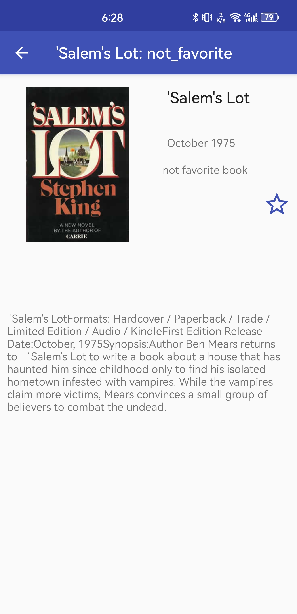

# Lab2: API Search Project

## Environment Setup:
Ensure JDK 17 and Android SDK 31 are installed. We rebuild this project with AndroidX. We created ResultDisplayActivity, MobileComputingApplication, FavoriteService interface and FavoriteServiceImpl, and we modified API_Search and Datum. Screenshots are provided in the same file directory. We used a real Android phone as a debugging device.

### Screenshots:

## Task1 (ResultDisplayActivity):
The application uses Intent to transmit Datum objects from API_Search activity to ResultDisplayActivity, where item details
are displayed. Users can toggle the favorite status of items, which is reflected in the UI updates and stored in SharedPreferences.

## Task2 (Back button):
The application uses ActionBar enabling the back button, displaying the title, and setting the title dynamically.

## Favorite feature:
This project implements a favorites feature in an Android application, allowing users to mark and manage their favorite items.

The implementation utilizes the FavoriteService interface for defining behaviors and FavoriteServiceImpl for actual execution, employing SharedPreferences and an ArrayList for the durable storage and management of favorite items.

## Getting Started:
To use this project, import it into Android Studio. Besides, there are 2 APKs in the file:
- app-release.apk stored in `\APISearchAndroid\app\release` file.
- app-debug.apk stored in `\APISearchAndroid\app\build\outputs\apk\debug` file.

## Key Components:
- **FavoriteService** Interface: Defines the contract for favorite item operations.
- **FavoriteServiceImpl**: Implements favorite management functionality.
- **ResultDisplayActivity**: Displays item details and allows users to toggle favorite status, also using action bar to enable back button and set title.
- **Datum**: Implement Serializable to allow for Intent transmission of item details.
- **MobileComputingApplication**: Initializes an instance with double-check locking and a global context for application to access application-level resources or contexts, such as SharedPreferences.

## Dependencies:
- Picasso for image loading
- Slf4j for logging
- JUnit for testing

<iframe src="https://bjtueducn-my.sharepoint.com/personal/17281207_bjtu_edu_cn/_layouts/15/embed.aspx?UniqueId=106053ae-9a8a-42a8-81db-680d653e45dc" width="640" height="360" frameborder="0" scrolling="no" allowfullscreen title="截屏2024-02-15 20.33.33.png"></iframe>
